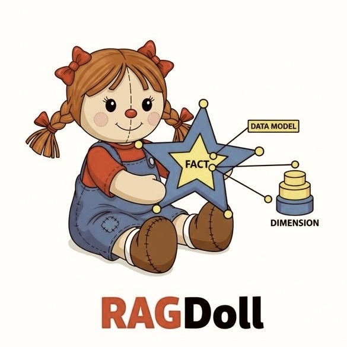

# RAGdoll: Experimenting with RAG Again (now with static embedding models)

  

experimental rag and data processing with static embedding models via [model2vec](https://github.com/MinishLab/model2vec), eventually LLM-driven semantic data modeling like meta's lcm paper, and other experimental stuff.

the system features a modular Python backend service, exposed via FastAPI - cient interactions are available via a big and lofty Python CLI, with a modern interactive frontend potentially coming.

the LLM component is designed to interface with any external OpenAI-compatible API (`mlx-lm` is what I've tested with)

## Features

* **Efficient Vectorization & Retrieval:**
  * Employs fast and effective embedding models (e.g., Model2Vec Potion, Sentence Transformers).
  * Uses [Vicinity](https://github.com/MinishLab/vicinity) as a lightweight, efficient vector store.
* **Optional Zero-Shot Classification:** Classify chunks into predefined categories during processing.
* **UMAP Visualization:** Generate 2D projections of chunk embeddings for visual exploration.
* **Tokenlearn Integration (Workflow):** Guidance and helper targets for using [Tokenlearn](https://github.com/MinishLab/tokenlearn) to train/fine-tune custom `StaticModel` (Model2Vec) instances for improved embedding quality and domain adaptation.

## Training Custom Embedding Models with Tokenlearn

For optimal performance on your specific data, you can train or fine-tune `StaticModel` instances using Tokenlearn. See `docs/tokenlearn_usage.md` for a detailed guide and Makefile targets (`make tokenlearn-prepare`, `make tokenlearn-custom-train`).

# 3rd party packages

relies heavily on some fantastic projects (please refer to their licenses for usage):

* [The Minish Lab's](https://github.com/MinishLab) [vicinity](https://github.com/MinishLab/vicinity): super lightweight low-dependency vector store for nearest neighbor search, with support for different backends and evaluation
* [The Minish Lab's](https://github.com/MinishLab) [model2vec](https://github.com/MinishLab/model2vec): turn any sentence transformer model into a really small static model - this quick POC uses an 8M parameter model, `minishlab/potion-base-8M`, distilled by the `model2vec` team, from `baai/bge-base-en-v1.5`. crazy fast (as is the 32M). for best performance, you really should train it within your domain. check out their work though - they have some innovative approaches that i haven't come across much before.
* text chunking via [semchunk](https://github.com/isaacus-dev/semchunk), and an embedding based one, [chonkie](https://github.com/chonkie-inc/chonkie)
